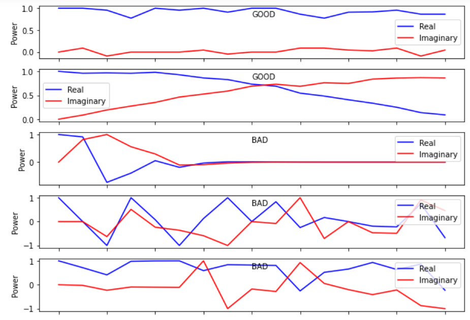
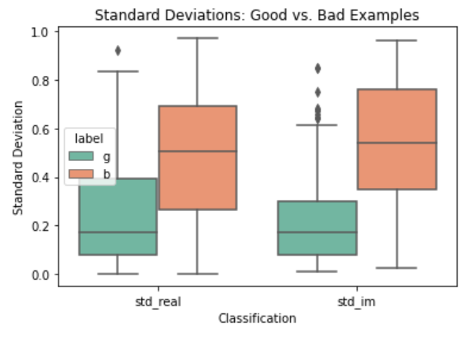
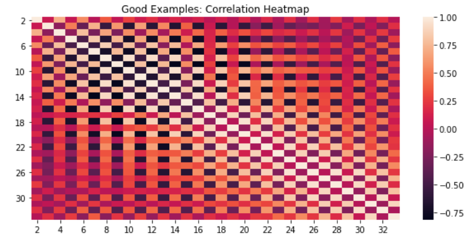
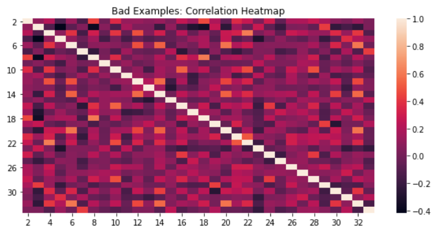
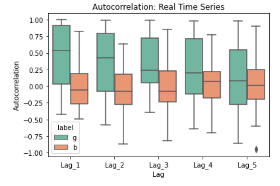

# ionosphere

_This project is adapted from an analysis I conducted for COMP 551, McGill's Applied Machine Learning course._

This notebook demonstrates how **statistical analysis and feature engineering** can allow us to outperform reference models in the literature.

The ionosphere dataset came from a 1989 paper from Sigillito et al. [here](https://www.semanticscholar.org/paper/Classification-of-radar-returns-from-the-ionosphere-Sigillito-Wing/e0d2de05caacdfa8073b2b4f77c5e72cb2449b81). The paper describes how radar signals backscattered by ionospheric density irregularities or clutter can provide meaningful information for "classification of ionospheric/magnetospheric regions or boundaries" amongst other applications. However, discriminating between backscattered signals that are "usable" or "not usable" is an extremely time-consuming task when undertaken manually.

Instead, they evaluate the usage of neural networks with a single hidden layer. They train models with 0 hidden nodes, referred to as their single layer network (which is the same as the logistic regression model we're using), to 15 hidden nodes, referred to as their Multilayer Feedforward Network (MLFN).

They found that their single layer network achieved **92.5% accuracy on their test set.**

Via feature engineering and selection, the simple logistic regression model in this notebook achieves **94.3%** test accuracy, thus **outperforming the published reference model.**

# Feature Engineering

The data comes in the form of a 17-point time series, wherein each point provides a real and imaginary component. Thus we can consider this as two timeseries: one real and one imaginary. By viewing the data as a time series, this opens up new pathways for analysis.

The first importnat observation was that the "bad" examples appeared demonstrated signifantly more variance than the "good" examples. Here are some examples to show what I mean:

As such, the first engineered features I explored was the **standard deviation of the real/imaginary time series**. These boxplots on the training data demonstrate this to be a discriminative feature:

Next, it was also observed that measurements in the good examples demonstrated correlation with adjacent measurements (as one would expect for a relative smooth time series). This structure is apparent in this correlation heatmap:

In comparison, this is the correlation for the bad examples:

As such, the next engineered features was the **autocorrelation of the real/imaginary time series**. I calculated this with offsets of 1 to 5 time lags. Once again, this was shown to be a discriminative feature. Below I show the autocorrelation at different lags for the real time series; the imaginary time series gave very similar results.

# Feature Selection

In order to choose the best subset of original and newly engineered features, I first used a random forest to estimate feature importances. This is estimated by averaging the impurity decresae caused by thresholding on a specific feature across all decision trees.

Then, 5-fold cross-validation was used with logistic regression on subsets of features starting with only the most important feature, and ending with all the features. This essentially conducts a linear search on mean impurity decrease to decide what amount of features to include.

The logistic regression model used _elastic net_ regularization, thus the hyperparameter search was over the regularization coefficient C and the % of l1 regularization. Also, both the random forest and regression models were fitted in a pipeline with a sklearn StandardScaler to standardize the input data before model training.

# Results

The optimal blend of features included a subset of the original features as well as:

- Real standard deviation
- Imaginary standard deviatoin
- Real autocorrelation at time lags of 1 and 2
- Imaginary autocorrelation at time lags of 1 and 2

This model was then scored on our test set, and achieved an accuracy of **94.3%**. Validation accuracy was **94.6%** while training accuracy was **96.7%**.

Some other test metrics:

- f1 score: 0.9538
- precision score. 1.000
- recall score: 0.9118
